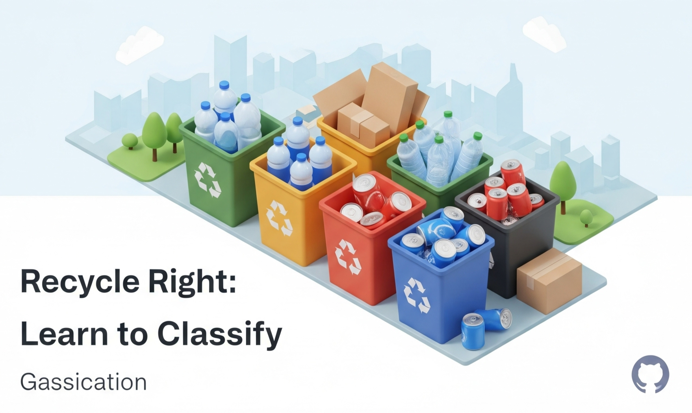

<p align="center">
  
</p>

<div align="center">

# 智能垃圾分类教育平台

这是一个功能全面的智能垃圾分类主题的Web教育平台。项目旨在通过多样化的功能，向公众普及垃圾分类知识，提升环保意识，并促进社区内的资源循环利用。

</div>

---

### ✨ 项目特色 (Features)

<table>
  <tr>
    <td width="50%">
      <strong>📚 知识学习</strong><br>
      管理员可以发布图文并茂的垃圾分类知识文章，用户可以随时浏览和学习。
    </td>
    <td width="50%">
      <strong>🎬 教育视频</strong><br>
      支持嵌入外部视频源（如B站），以生动有趣的方式进行环保教育。
    </td>
  </tr>
  <tr>
    <td width="50%">
      <strong>🎮 分类游戏</strong><br>
      内置一个支持拖拽操作的垃圾分类小游戏，让用户在娱乐中巩固知识，并记录排行榜。
    </td>
    <td width="50%">
      <strong>📸 随手拍</strong><br>
      用户可以随时随地上传照片，上报身边发现的环境问题，形成一个公开的“问题广场”。
    </td>
  </tr>
  <tr>
    <td width="50%">
      <strong>♻️ 旧物利用</strong><br>
      一个社区型的“环保跳蚤市场”，用户可以发布自己的闲置物品信息，寻找自己需要的物品。
    </td>
    <td width="50%">
      <strong>🔐 安全的后台管理</strong><br>
      提供一个功能强大的管理员仪表盘，可以对用户、视频、文章等所有内容进行统一管理。
    </td>
  </tr>
</table>

---

### 🛠️ 技术栈 (Tech Stack)

<p align="center">
  
  
  
  
  
  <br>
  
  
  
  
  
</p>

---

### 🚀 快速开始 (Getting Started)

<details>
<summary>点击展开详细步骤</summary>

#### 1. 环境准备 (Prerequisites)

请确保你的电脑上已经安装并配置好以下环境：

* **JDK**: 1.8 或更高版本
* **Maven**: 3.6 或更高版本
* **Apache Tomcat**: 9.0 或更高版本
* **MySQL**: 5.7 或更高版本
* **IDE**: 推荐使用 IntelliJ IDEA 或 Eclipse

#### 2. 数据库设置 (Database Setup)

1.  启动你的MySQL服务。
2.  创建一个新的数据库（Schema），建议命名为 `ZNLJFL`。
3.  将项目中的 `ZNLJFL.sql` 文件导入到你刚刚创建的数据库中，这将自动创建所有需要的表结构。

#### 3. 项目配置 (Configuration)

1.  在IDE中打开项目。
2.  找到数据库连接工具类：`src/main/java/com/javaweb/util/DBUtil.java`。
3.  根据你自己的MySQL设置，修改该文件中的数据库URL、用户名和密码。

    ```java
    // DBUtil.java
    private static final String URL = "jdbc:mysql://localhost:3306/ZNLJFL?useSSL=false&serverTimezone=UTC";
    private static final String USER = "你的数据库用户名"; // <-- 修改这里
    private static final String PASSWORD = "你的数据库密码"; // <-- 修改这里
    ```

#### 4. 部署与运行 (Deployment & Running)
* 在IDEA上自己可以搜教程配置tomcat运行，不需要进行打包。

1.  **打包**: 在项目根目录下，打开终端，运行Maven命令将项目打包成一个 `.war` 文件。
    ```bash
    mvn clean package
    ```
2.  **部署**: 将 `target` 目录下生成的 `.war` 文件（例如 `ZNLJFL-1.0-SNAPSHOT.war`）复制到你Tomcat安装目录下的 `webapps` 文件夹中。
3.  **启动**: 启动你的Tomcat服务器。
4.  **访问**: 打开浏览器，访问 `http://localhost:8080/你的应用名/` (例如 `http://localhost:8080/ZNLJFL-1.0-SNAPSHOT/`)，即可看到网站首页。

</details>

---

### 🔑 如何使用 (Usage)

<details>
<summary>点击展开使用说明</summary>

1.  **注册普通用户**: 通过网站的注册页面正常注册一个新账号。
2.  **提升为管理员**:
    * 初始管理员账号admin，密码123456。
    * 使用数据库管理工具连接到你的 `ZNLJFL` 数据库。
    * 执行以下SQL语句，将你的用户角色提升为管理员：
        ```sql
        UPDATE Users SET role = 'admin' WHERE username = '你刚刚注册的用户名';
        ```
3.  **登录管理员后台**:
    * 注销后，使用该账号重新登录。
    * 你将在导航栏看到“管理后台”的入口，点击即可进入。

</details>

---

### 👨‍💻 作者 (Author)
* **GitHub**: [https://github.com/WinriseF](https://github.com/WinriseF)
* 其实是我的Javaweb作业，你可以拿去悄悄的交，声张的不要
---

### 📄 开源许可 (License)

本项目采用 [MIT License](https://opensource.org/licenses/MIT) 开源许可。

